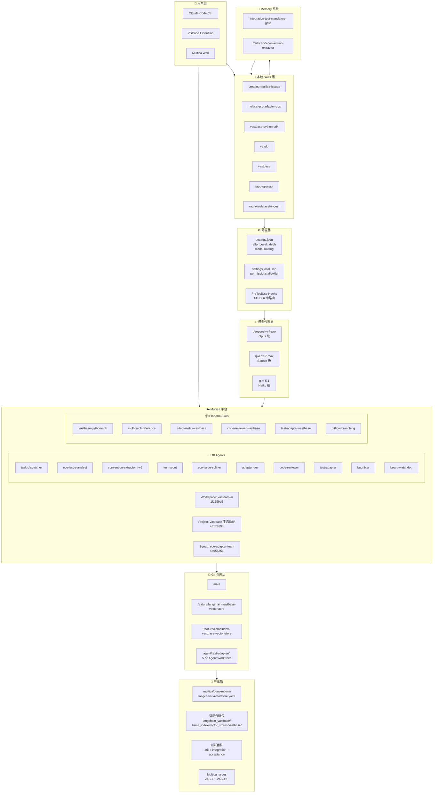
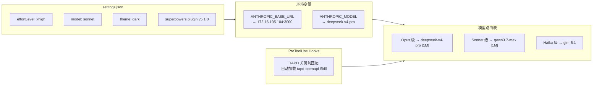
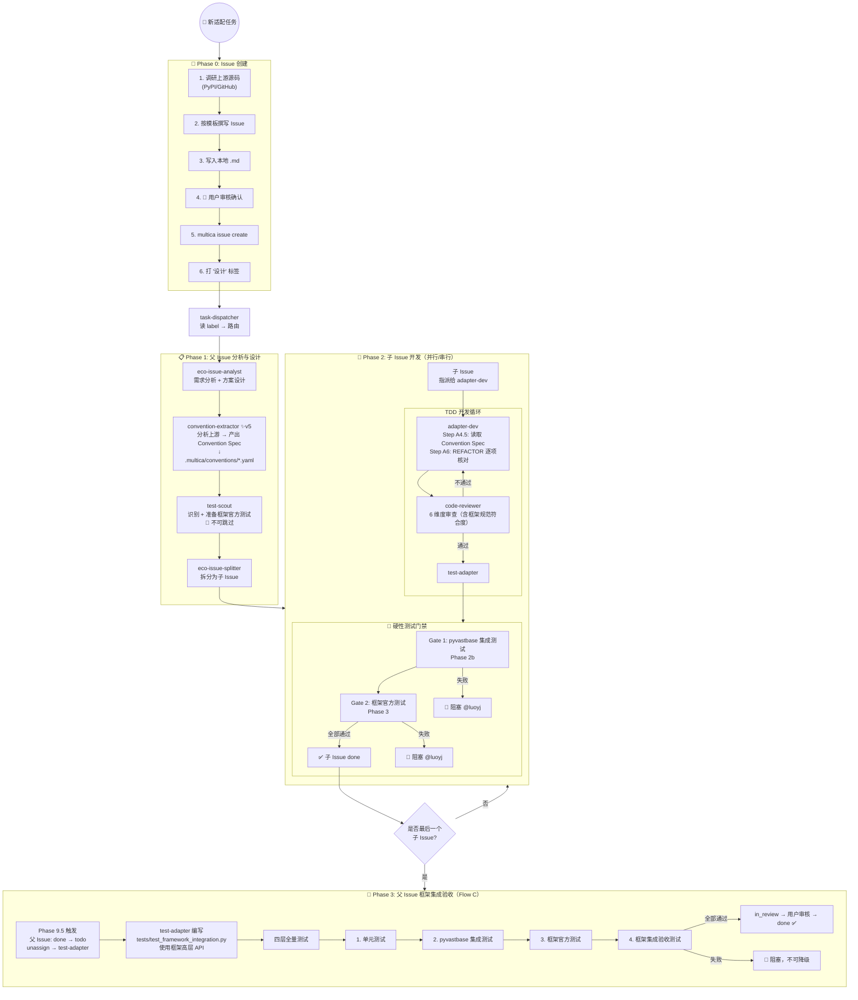
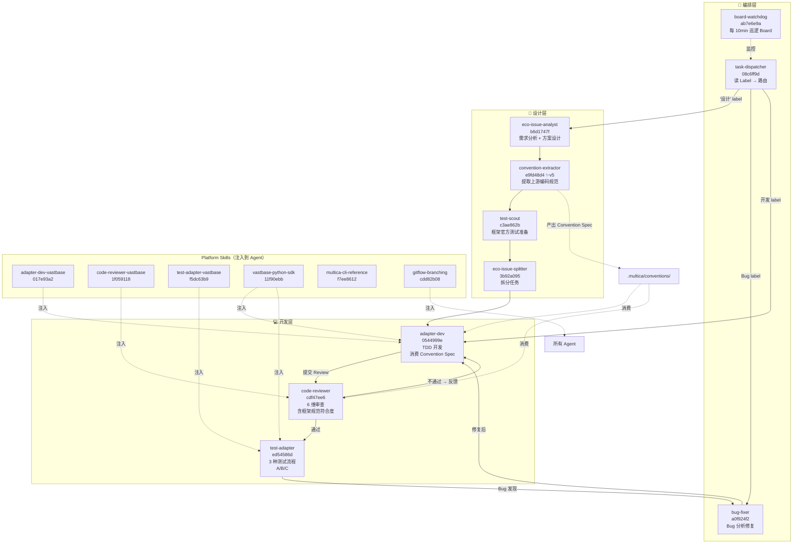
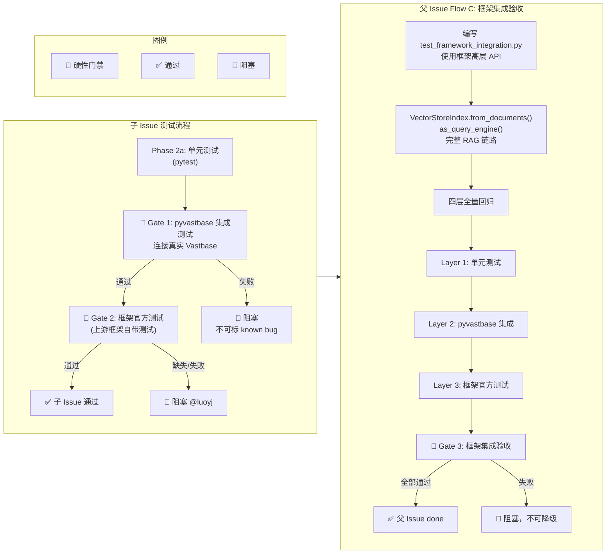
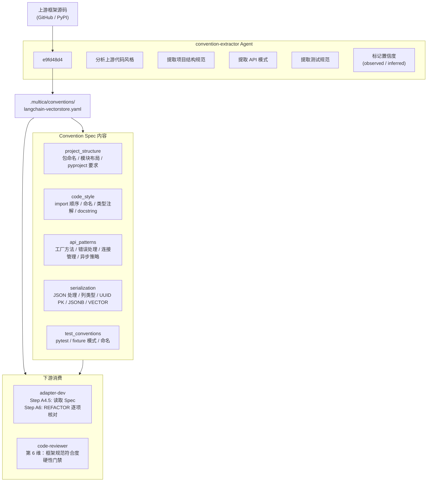
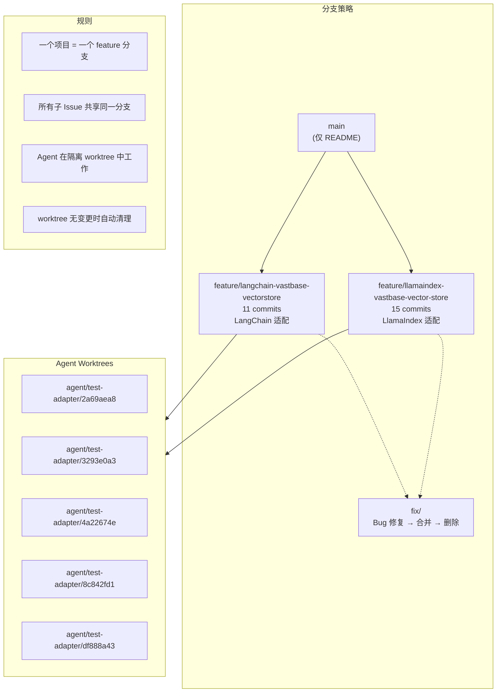
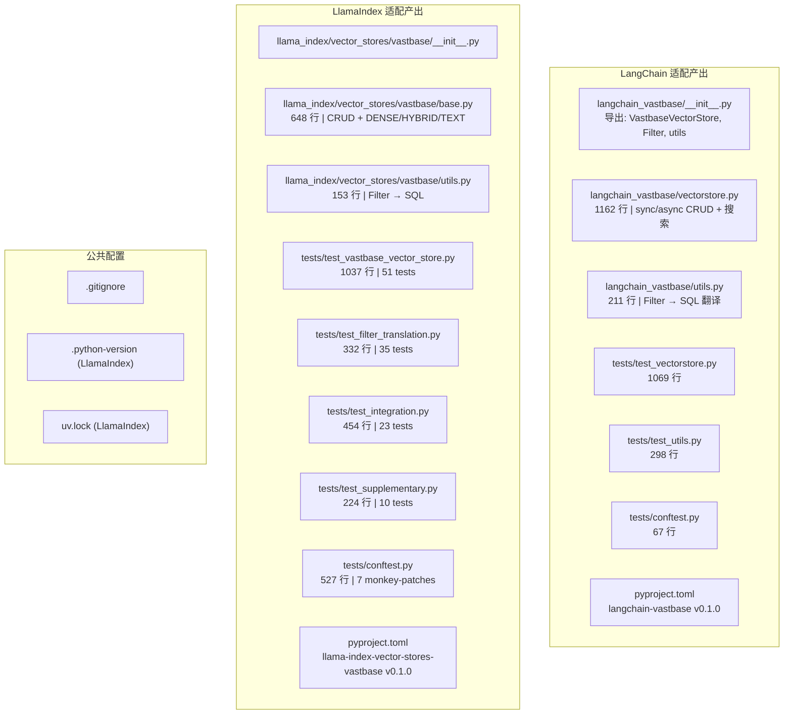
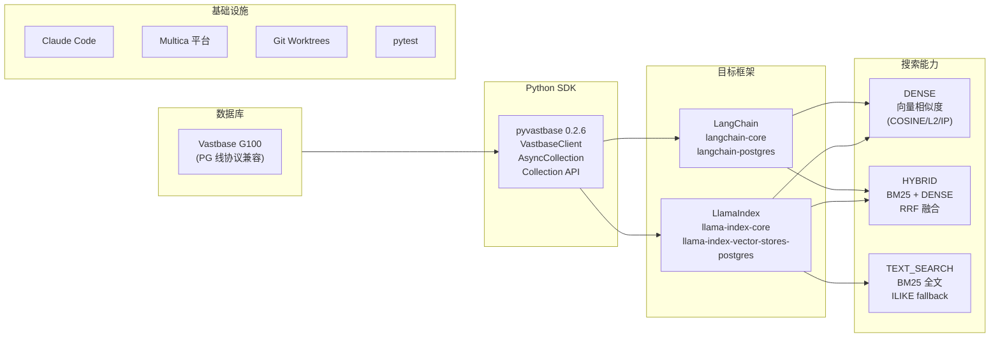

# Multica 生态适配系统架构图

> 生成日期：2026-06-11 | 版本：v5

---

## 1. 系统全景图

---

## 2. 配置与模型路由

---

## 3. Multica v5 工作流全景

---

## 4. Agent 协作关系图

---

## 5. 测试门禁体系

---

## 6. Convention Spec 数据流（v5 新增）

---

## 7. 分支策略与工作空间

---

## 8. 项目产出物结构

---

## 9. 关键技术栈

---

## 10. 核心数据流总结

| 阶段 | 输入 | 处理者 | 输出 |
|------|------|--------|------|
| **Issue 创建** | 上游框架 URL | 用户 + creating-multica-issues Skill | VAS Issue (打"设计"标签) |
| **需求分析** | VAS Issue | eco-issue-analyst | 技术方案设计 |
| **规范提取** ✨v5 | 上游框架源码 | convention-extractor | `.multica/conventions/*.yaml` |
| **测试准备** | 上游框架仓库 | test-scout | 框架官方测试用例 |
| **任务拆分** | 设计方案 + 规范 + 测试 | eco-issue-splitter | 子 Issue 列表 |
| **TDD 开发** | Convention Spec + 子 Issue | adapter-dev | 适配代码 |
| **代码审查** | PR diff + Convention Spec | code-reviewer (6维) | Review 结果 |
| **子 Issue 测试** | 适配代码 | test-adapter (Flow A) | Gate 1+2 通过 |
| **集成验收** | 所有子 Issue 代码 | test-adapter (Flow C) | Gate 3 通过 ✅ |
| **持续监控** | Multica Board | board-watchdog | 每10min 状态更新 |
